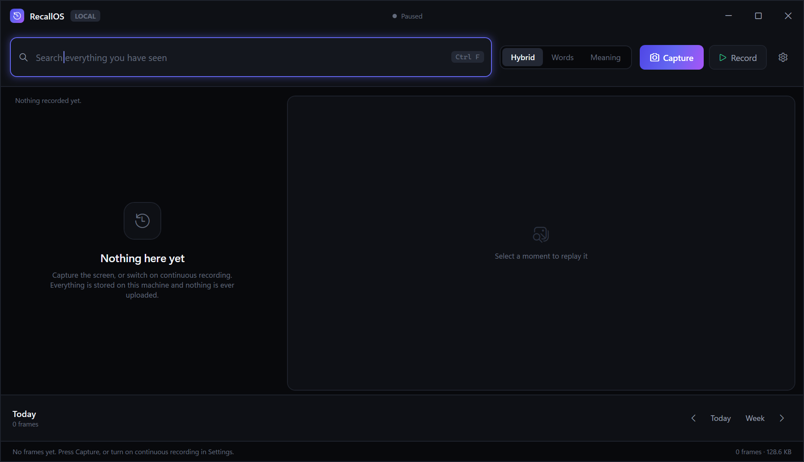
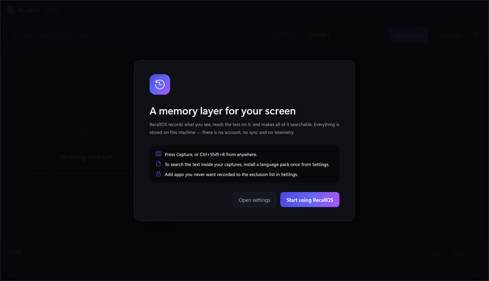
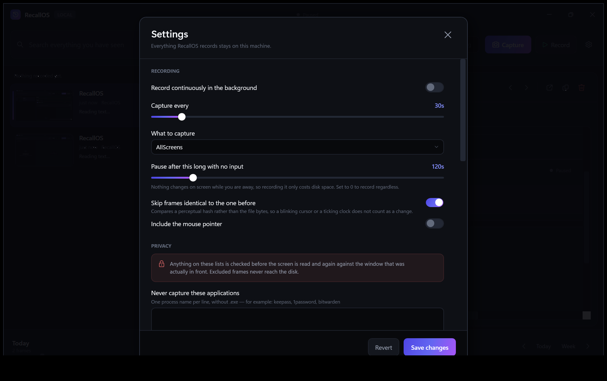

<div align="center">

# RecallOS

**A memory layer for Windows.**
Records what is on your screen, reads the text on it, and makes all of it searchable —
entirely on your own machine.

[](https://github.com/anshppatel4-crypto/recallos/actions/workflows/ci.yml)
[](LICENSE)
[](#download)
[](https://anshppatel4-crypto.github.io/recallos/)
[](#privacy)



</div>

---

It is not a screenshot tool. A screenshot tool gives you files. RecallOS gives you a
searchable substrate: every frame is indexed by its text, labelled with the activity it
shows, placed on a timeline, and reachable by meaning as well as by wording.

| | |
|---|---|
| **Capture** | Win32 GDI `BitBlt` over the virtual screen, one monitor, or the foreground window. Manual, on a global hotkey, or continuously on a timer. |
| **Extract** | Tesseract OCR with word geometry, run off the capture path in a background queue. |
| **Store** | One SQLite database plus a date-foldered image tree, in a single portable folder. |
| **Search** | FTS5/BM25 keyword search, cosine similarity over chunk embeddings, or a blend of both. |
| **Replay** | The original screenshot beside its extracted text, with step-forward/back through time. |
| **Understand** | Per-frame activity labels and an activity histogram you can scrub and click. |

---

## Download

**[Download the latest release →](https://github.com/anshppatel4-crypto/recallos/releases/latest)**  ·  **[Website →](https://anshppatel4-crypto.github.io/recallos/)**

Unzip it anywhere and run `RecallOS.exe`. Nothing to install — the build is self-contained,
so you do **not** need the .NET runtime.

> Windows SmartScreen will warn about an unrecognised publisher, because the build is not
> code-signed. **More info → Run anyway.**

### Turning on text search

Screen capture works immediately. Reading the text inside your captures needs a Tesseract
language pack, which is too large to bundle, so RecallOS treats it as an opt-in asset:

> **Settings → Text extraction → Install language**

That is the only time RecallOS uses the network, and only when you press the button. Until
then frames are captured and stored as normal and held as `Pending`; the moment a language
pack appears, the background sweep works through the whole backlog and it all becomes
searchable retroactively.

---

## Searching

Type words. Everything else is optional:

```
invoice                              words anywhere in the captured text
"pull request"                       an exact phrase
app:chrome                           only frames from a given process
title:github                         window titles containing this
after:yesterday before:2026-03-01    time bounds
on:2026-03-04                        a single day
after:7d   after:24h                 relative offsets
budget app:code after:monday         combined
```

Three ranking modes:

- **Words** — BM25 over the FTS5 index. Exact, fast, and the right answer when you remember
  an actual word you saw.
- **Meaning** — cosine similarity over chunk embeddings. Finds the frame when you remember
  the gist but not the wording.
- **Hybrid** (default) — both, min-max normalised and blended, with a bonus where they
  agree. The two fail in opposite directions, so together they cover more than either.

**Shortcuts** — `Ctrl+Shift+R` capture from anywhere · `Ctrl+F` focus search ·
`Alt+←/→` step through time · `F5` refresh · `Ctrl+Delete` delete the selected frame

<div align="center">


</div>

---

## Privacy

The design assumption is that a tool which records your screen has to be auditable by the
person it records.

- **Nothing leaves the machine.** No telemetry, no account, no sync. The only outbound
  request in the entire codebase is the language-pack download, behind an explicit button.
- **Exclusions are absolute.** Processes and window-title phrases on the exclusion list are
  checked before the screen is read, and again against the window that was actually in
  front at the instant of the grab. Excluded frames never reach the disk.
- **Recording is off until you turn it on**, pauses when you are away, and refuses to
  capture a locked session or a secure desktop.
- **The tray icon is visible whenever it runs.** A background recorder with no visible
  handle is exactly the thing people are right to distrust.
- **Limits are enforced, not suggested.** An age cap and a size cap both apply; oldest goes
  first. *Erase everything* deletes frames, text, index and images, then reclaims the space.

Everything lives in `%LOCALAPPDATA%\RecallOS`. Delete that folder and RecallOS has no memory
of anything.

---

## Architecture

```
RecallOS.App  (WPF, MVVM)          Views · ViewModels · tray · global hotkey
      │
RecallOS.Core                      the entire engine, no UI dependency
      ├── Capture/       GDI BitBlt, DPI-aware, perceptual hashing
      ├── Ocr/           Tesseract engine, text normalisation, chunking
      ├── Storage/       SQLite schema + migrations, repository, file store
      ├── Search/        query parser, FTS5 + vector retrieval, snippets
      ├── Intelligence/  embeddings, vector math, intent classification
      ├── Pipeline/      capture pipeline, OCR queue, scheduler
      └── Maintenance/   retention and eviction
```

Every service sits behind an interface and is registered with `TryAdd`, so a host or a test
can substitute its own implementation and have it win. `RecallOS.Core` has no reference to
WPF: the engine could be driven by a CLI or a service with no changes.

### Data model

```
frames ──┬── chunks ──── embeddings        settings
         └── frames_fts (FTS5, external content)
```

`frames` is the record of a moment: when, what image, which window and process, the
extracted text, an activity label. `chunks` are paragraph-sized spans of that text — the
unit of embedding, because a whole screenful averages into meaninglessness and a single line
carries too little. `frames_fts` is an external-content FTS5 index kept in step by triggers,
so the text is indexed without being stored twice.

### Decisions worth knowing

**Capture and OCR are split across a queue.** Grabbing pixels takes tens of milliseconds;
recognising a dense 4K screen takes seconds. Run together, a 5-second interval falls behind
within a minute. The synchronous stage does only what makes the moment durable — capture,
hash, write, insert — and returns. The frame appears in the timeline immediately, marked
pending; text, chunks, embeddings and labels fill in behind it.

**Change detection is perceptual, not byte-wise.** Ten minutes of reading one page produces
twenty byte-different but visually identical PNGs, because a caret blinks and a clock ticks.
A 64-bit dHash compared within a small Hamming distance catches those; a file hash never
would.

**Semantic search has no ANN index, deliberately.** At 256 dimensions a SIMD dot product is
a few nanoseconds, so a few hundred thousand chunks scan in well under a second. An
approximate index would add a structure to build, maintain and corrupt for no gain anyone
could perceive at this scale. `ScoreBySimilarityAsync` is the one place that changes if a
store ever outgrows that.

**The embedding provider is honest about what it is.** `HashingEmbeddingProvider` is feature
hashing over words, bigrams and character trigrams — fuzzy lexical matching that degrades
gracefully where exact matching returns nothing. It carries no learned semantics and will
not match *car* to *automobile*. Every vector is stored against a `ModelId`, so dropping in
a real sentence-transformer means registering a new provider and letting the backfill run:
old and new vectors coexist, are never compared, and the store stays searchable throughout.
No migration, no downtime.

**Record means record.** Deduplicating visually identical frames is an obvious way to
save disk, and it was the default until it was tested against how the feature reads: a
screen that is not changing much produces one frame and then nothing, which is
indistinguishable from a broken recorder. Deduplication is now opt-in, the capture interval
defaults to ten seconds rather than thirty, and a live countdown in the title bar shows the
recorder is still working between frames. Storage is bounded by the retention caps instead,
which prune predictably rather than silently declining to record.

**Rows are deleted before files.** A crash mid-sweep then leaves an orphaned image with no
row — invisible, and reclaimed next sweep. The opposite order would leave rows pointing at
files that no longer exist, which the user meets as broken results in their own history.

**The release is a folder, not a single file.** Single-file publishing is not used because
Tesseract's interop loader resolves its native libraries relative to `Assembly.Location`,
which is empty inside a single-file bundle; it then throws before any fallback and OCR never
initialises. This was found by shipping it and reading the log, and `build/publish.ps1` now
fails the build if the native libraries are missing rather than shipping an app whose text
search silently never works.

---

## Building from source

Requires the .NET 8 SDK or newer.

```bash
git clone https://github.com/anshppatel4-crypto/recallos.git
cd recallos

dotnet test                                  # 135 tests
dotnet run --project src/RecallOS.App        # run it

pwsh build/publish.ps1 -Version 1.0.0        # produce the release zip
```

### Tests

135 tests, run against the real SQLite schema, the real FTS5 index, real files on disk, the
real Win32 capture path and the real Tesseract engine rather than mocks — those layers are
almost entirely SQL and P/Invoke, so mocking them would test nothing that could break.

Coverage includes FTS trigger correctness (stale terms must not resurrect after an edit or
delete), `ulong` hash round-tripping through a signed integer column, cascade deletes,
embedding determinism across processes, perceptual-hash tolerances, query-parser hardening
against FTS operator injection, and a GDI object-leak check across repeated captures.

The privacy guarantees are tested as behaviour, not documentation: excluded processes and
title keywords are asserted to produce no database row and no file on disk, for manual
captures as well as automatic ones, and an idle or locked session is asserted never to reach
the screen at all. Those tests drive the pipeline through a synthetic screen, and the OCR
tests read text rendered to a bitmap, so the suite never reads or stores your actual desktop.

Tests that need something the machine may not have degrade to a no-op rather than a failure:
the capture tests when there is no interactive desktop, the OCR tests when no language pack
is installed. A machine without a language pack is a supported configuration — it is exactly
the state the app ships in.

---

## Extending it

The seams are the interfaces in `RecallOS.Core/Abstractions`. Register a replacement before
`AddRecallOs()` and it takes precedence:

| To change | Implement | Notes |
|---|---|---|
| OCR engine | `IOcrEngine` | e.g. Windows.Media.Ocr, or a cloud recogniser |
| Embeddings | `IEmbeddingProvider` | give it a new `ModelId`; the backfill handles the rest |
| Activity labels | `IIntentClassifier` | a learned model drops in behind the same contract |
| Retrieval | `ISearchService` | ranking is entirely replaceable |
| Capture | `IScreenCaptureService` | e.g. Windows.Graphics.Capture for per-window composition |

The schema is versioned in `DatabaseBootstrapper`: add a numbered migration and it applies
in order, in a transaction, without asking the user to discard their history.

---

## License

MIT — see [LICENSE](LICENSE).
